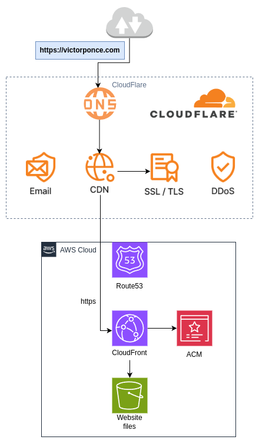

# Website: Arquitectura de mi sitio web | AWS + Cloudflare

## 1. Resumen

Hace poco creé mi página web personal y estuve buscando una opción de **bajo costo**, **segura** y que aprovechara el poder de la **nube** para alojarla.  
Este proyecto muestra la arquitectura que implementé utilizando **AWS** y **Cloudflare**, logrando un hosting **seguro, escalable y prácticamente gratuito**.

<em>(img. 1 – Diagrama de Arquitectura)</em>

## 2. Tecnologías principales

- **AWS S3**, **CloudFront**, **ACM**, **Route 53**  
- **Cloudflare** (CDN, WAF, DNS, TLS)  
- **Infraestructura Serverless y 100% estática** 

## 3. Cloudflare

- **Plan gratuito:** Muy potente. Incluye protección DDoS, CDN global, certificado TLS, reglas personalizadas y un WAF básico.  
- **DNS:** Cloudflare administra el DNS del dominio. Se deben cambiar los registros NS de la zona pública (por ejemplo, desde Route 53) para apuntar a los de Cloudflare.  
- **CDN (Content Delivery Network):** Permite servir el contenido del sitio desde ubicaciones cercanas al usuario final, mejorando la latencia y seguridad.  
- **TLS:** Proporciona una conexión segura por HTTPS entre el CDN y el usuario.  
- **DDoS:** Protección básica integrada contra ataques de denegación de servicio.  
- **Email Routing:** Permite crear direcciones de correo con tu dominio y redirigirlas a cuentas existentes (Gmail, Outlook, etc.).

---

## 4. Amazon Web Services (AWS)

- **Amazon S3:** Bucket configurado de forma privada donde se almacenan los archivos estáticos del sitio (HTML, CSS, JS). Actúa como origen de CloudFront.  
- **Amazon CloudFront:** CDN que distribuye el contenido del bucket S3 y sirve como origen del CDN de Cloudflare, garantizando rendimiento y seguridad.  
- **AWS Certificate Manager (ACM):** Genera un certificado TLS para encriptar la comunicación entre CloudFront y Cloudflare, logrando cifrado extremo a extremo.  
- **Amazon Route 53:** Servicio DNS donde está alojada la zona pública del dominio. Aquí se actualizan los registros NS para delegar la administración a Cloudflare.

---

## 5. Seguridad

Esta arquitectura garantiza:
- Protección ante ataques **DDoS**.  
- **Cifrado end-to-end** (de usuario a S3).  
- **Bucket S3 privado**, evitando exposición pública y ataques de tipo *Denial of Wallet (DoW)*.

---

## 6. Costos aproximados

| Servicio | Descripción | Costo mensual |
|-----------|--------------|----------------|
| **Cloudflare** | Plan gratuito con CDN, WAF básico y TLS | **$0 USD** |
| **AWS CloudFront** | Dentro del free tier | **$0 USD** |
| **AWS ACM** | Certificados gratuitos | **$0 USD** |
| **AWS S3** | 100 MB + pocas solicitudes | **$0.10 USD** |
| **Total estimado** |  | **≈ $0.10 USD / mes** |

 **Costos no incluidos:**  
- Mantención del dominio  
- Zona pública DNS (gratuita en la mayoría de los casos, aprox. $0.5 USD/mes en Route 53)
 

