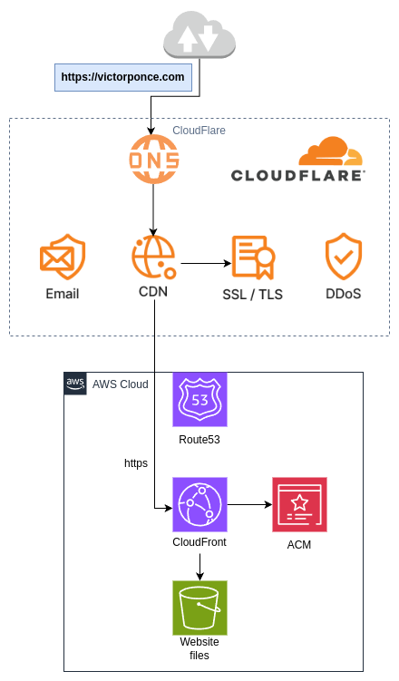

# Website: My Web Architecture | AWS + Cloudflare

## 1. Overview

Recently, I created my personal website and was looking for a **low-cost**, **secure** option that leveraged the power of the **cloud** to host it.  
This project showcases the architecture I implemented using **AWS** and **Cloudflare**, achieving a **secure, scalable, and almost free** hosting solution.

<em>(img. 1 – Architecture Diagram)</em>

## 2. Main Technologies

- **AWS S3**, **CloudFront**, **ACM**, **Route 53**  
- **Cloudflare** (CDN, WAF, DNS, TLS)  
- **Serverless and 100% static infrastructure**  

---

## 3. Cloudflare

- **Free Plan:** Very powerful. Includes DDoS protection, global CDN, TLS certificate, custom rules, and a basic WAF.  
- **DNS:** Cloudflare manages the domain’s DNS. You need to update the NS records in the public zone (for example, in Route 53) to point to Cloudflare’s nameservers.  
- **CDN (Content Delivery Network):** Serves website content from locations close to end users, improving latency and security.  
- **TLS:** Provides a secure HTTPS connection between the CDN and the user.  
- **DDoS:** Basic integrated protection against denial-of-service attacks.  
- **Email Routing:** Allows you to create custom domain-based email addresses and forward them to existing inboxes (Gmail, Outlook, etc.).

---

## 4. Amazon Web Services (AWS)

- **Amazon S3:** Private bucket storing the static website files (HTML, CSS, JS). It serves as the origin for CloudFront.  
- **Amazon CloudFront:** CDN that distributes content from the S3 bucket and acts as the origin for Cloudflare’s CDN, ensuring performance and security.  
- **AWS Certificate Manager (ACM):** Generates a TLS certificate to encrypt communication between CloudFront and Cloudflare, ensuring end-to-end encryption.  
- **Amazon Route 53:** DNS service hosting the public zone of the domain. The NS records are updated here to delegate DNS management to Cloudflare.

---

## 5. Security

This architecture ensures:
- Protection against **DDoS** attacks.  
- **End-to-end encryption** (from user to S3).  
- A **private S3 bucket**, preventing public exposure and *Denial of Wallet (DoW)* attacks.

---

## 6. Estimated Costs

| Service | Description | Monthly Cost |
|----------|--------------|----------------|
| **Cloudflare** | Free plan with CDN, basic WAF, and TLS | **$0 USD** |
| **AWS CloudFront** | Within free tier | **$0 USD** |
| **AWS ACM** | Free certificates | **$0 USD** |
| **AWS S3** | 100 MB + few requests | **$0.10 USD** |
| **Estimated Total** |  | **≈ $0.10 USD / month** |

**Not included:**  
- Domain maintenance  
- Public DNS zone (free in most cases, approx. $0.5 USD/month in Route 53)
